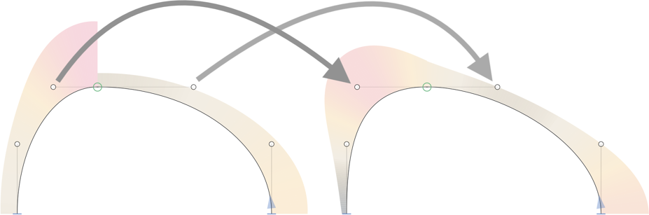

# Grey Harmony

Grey Harmony (*de:* Graue Harmonie, *fr:* Harmonie grise, *es:* Armonía gris, *cs:* Šedá harmonie, *pt:* Harmonia cinzenta, *ru:* Серая гармония, *jp:* 灰色の調和, *ko:* 회색 조화, *zh:* 🦛灰色和谐) is a Glyphs.app filter that G2-harmonizes selected “smooth” connections by moving the surrounding BCPs rather than the green on-curve node itself (which is what [Green Harmony](https://github.com/slobzheninov/GreenHarmony/) does).
 
## Usage

To harmonize the transition between two curve segments, select the green on-curve node between the two segments, and run *Filter > Grey Harmony* (Ctrl-Shift-X). The selected on-curve node will be moved to the G2 position (‘harmonized’) between the two adjacent handles:

<small>(Curvature visualisation: [Speed Punk](glyphsapp3://showplugin/Speed%20Punk) by @yanone.)</small>
 
You can run the filter on multiple on-curve points. If none are selected, all green on-curve points will be harmonized.
 
## Custom Parameter
 
You can have the filter run on all smooth connections between curves at export time with a custom parameter. This can be useful for automatically fixing interpolations. To do so, go to *File > Font Info > Exports,* select an instance, add a *Custom Parameter* with the plus button, choose *Filter* from the menu that pops up, and write `GreyHarmony` in the filter value:

## Warning

Use of this filter may alter your shape(s) quite a lot, so make sure you make a backup (at least in the background layer) before you apply the filter to many glyphs. If you want to harmonize but still preserve the shape as much as possible, consider Tim Ahrens’ [Remix Tools](https://remix-tools.com).

## Installation

Grey Harmony is [available in the Glyphs&nbsp;3 Plugin Manager](glyphsapp3://showplugin/Grey%20Harmony). Click on the *Install* button next to it and restart Glyphs.
 

# License

Copyright 2022 Rainer Erich Scheichelbauer (@mekkablue). Based on [Green Harmony](https://github.com/slobzheninov/GreenHarmony/) by Alex Slobzheninov (@slobzheninov), which in turn incorporates the [algorithm described by Simon Cozens](https://gist.github.com/simoncozens/3c5d304ae2c14894393c6284df91be5b) (@simoncozens), and builds on template code by Georg Seifert (@schriftgestalt) and Jan Gerner (@yanone). Help for the conversion into the plug-in by Rainer Erich Scheichelbauer (@mekkablue).

Licensed under the Apache License, Version 2.0 (the "License");
you may not use this file except in compliance with the License.
You may obtain a copy of the License at

http://www.apache.org/licenses/LICENSE-2.0

See the License file included in this repository for further details.
